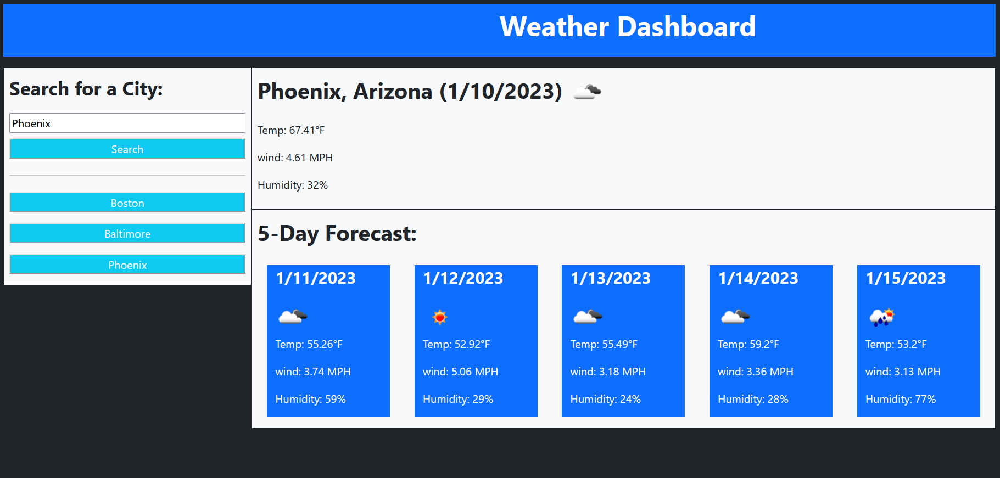
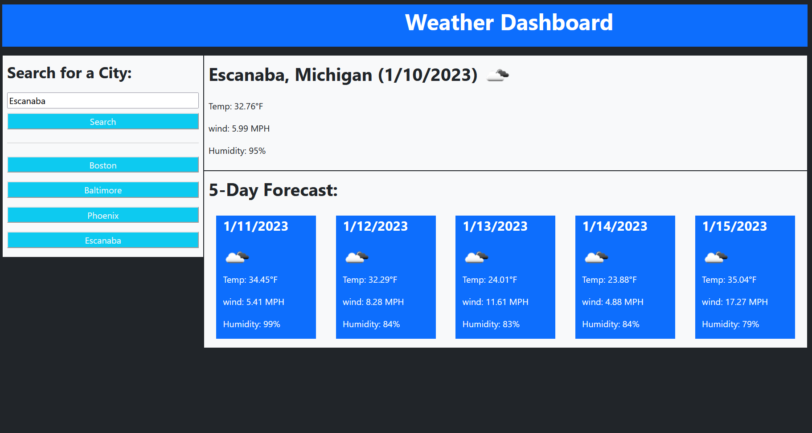

# Stev232sWeatherSite

## Description

This project is to create a Weather Dashboard that will display the weather for a searched city. This Weather Dashboard utilizes APIs related to Open Weather Map. This site stores previously searched locations to make it more convineant for the user to be able to lookup a city that they've searched in the past. The default city is my home town of Escanaba Michigan.

## Acceptance Criteria

GIVEN a weather dashboard with form inputs 
*WHEN I search for a city* 
__THEN__ I am presented with current and future conditions for that city and that city is added to the search history 
*WHEN I view current weather conditions for that city* 
__THEN__ I am presented with the city name, the date, an icon representation of weather conditions, the temperature, the humidity, and the the wind speed 
*WHEN I view future weather conditions for that city* 
__THEN__ I am presented with a 5-day forecast that displays the date, an icon representation of weather conditions, the temperature, the wind speed, and the humidity 
*WHEN I click on a city in the search history* 
__THEN__ I am again presented with current and future conditions for that city 

## ScreenShots

## Deployment Link

Link: https://stev232.github.io/Stev232sWeatherSite/
Resource used: https://openweathermap.org/